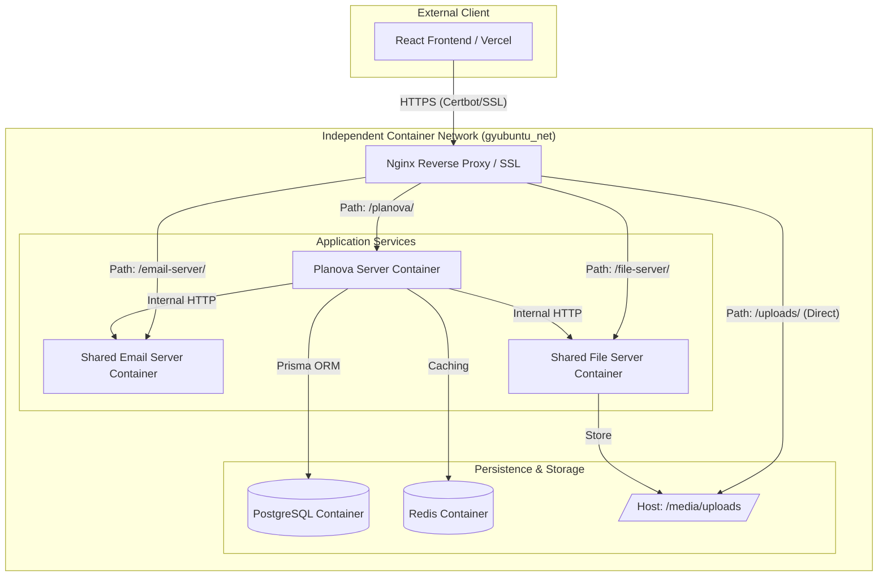

<p align="center">
  <a href="#" target="blank"></a>
</p>

# Planova Server

Planova 프로젝트의 백엔드 서버입니다. NestJS 프레임워크를 기반으로 하며, Prisma ORM과 PostgreSQL을 사용하여 데이터를 관리합니다. 실시간 협업을 위해 WebSocket(Socket.io)과 Redis를 활용한 고성능 아키텍처를 지향합니다.

---

## 🚀 Tech Stack

- **Framework**: [NestJS](https://nestjs.com/) (v11+)
- **Database**: [PostgreSQL](https://www.postgresql.org/)
- **ORM**: [Prisma](https://www.prisma.io/)
- **Real-time**: [Socket.io](https://socket.io/)
- **Caching**: [Redis](https://redis.io/)
- **Authentication**: [Passport](https://www.passportjs.org/) (JWT, Local, Google, Kakao)
- **Logging**: [Winston](https://github.com/winstonjs/winston)
- **Validation**: [class-validator](https://github.com/typestack/class-validator), [class-transformer](https://github.com/typestack/class-transformer)

---

## 📂 Project Structure

```text
src/
├── activity/          # 사용자 활동 로그 관리
├── auth/              # 인증 및 인가 (JWT, OAuth2)
├── comment/           # 작업(Task) 댓글 서비스
├── email/             # 이메일 발송 서비스
├── epic/              # 에픽(Epic) 관리
├── global/            # 공통 모듈 (Prisma, Redis, Config, Filter, Pipe 등)
├── image/             # 이미지 업로드 및 관리
├── label/             # 프로젝트 레이블 관리
├── milestone/         # 마일스톤 관리 및 진척도 계산
├── project/           # 프로젝트 관리
├── project-member/    # 프로젝트 멤버 및 권한 관리
├── subtask/           # 하위 작업 관리
├── task/              # 작업(Task) 및 칸반 보드 로직
├── user/              # 사용자 프로필 및 계정 관리
├── workspace/         # 워크스페이스 관리
└── workspace-member/  # 워크스페이스 멤버 관리
```

---

## ✨ Core Features

### 1. 실시간 데이터 동기화 (Real-time Sync)

- **Socket.io**를 사용하여 워크스페이스 및 프로젝트 내의 데이터 변경 사항을 실시간으로 모든 접속자에게 전파합니다.
- 특정 사용자의 작업 수정, 상태 변경, 멤버 추방 등의 이벤트 발생 시 즉각적인 UI 업데이트를 지원합니다.

### 2. 다중 인증 전략 (Multi-Strategy Auth)

- **JWT (JSON Web Token)** 기반의 보안 인증 체계를 갖추고 있습니다.
- **Local Login** 뿐만 아니라 **Google**, **Kakao** OAuth2 소셜 로그인을 지원합니다.
- Refresh Token을 Redis에 저장하여 보안성을 강화한 세션 관리를 수행합니다.

### 3. 이벤트 기반 아키텍처 (Event-Driven)

- **EventEmitter2**를 활용하여 모듈 간 결합도를 낮췄습니다.
- 특정 작업 완료 시 활동 로그 생성, 마일스톤 진척도 재계산 등의 부수 작업을 비동기 이벤트로 처리합니다.

### 4. 데이터 정밀 관리 (Data Integrity)

- **Prisma**를 통한 선언적 스키마 관리와 커스텀 `@Transactional()` 데코레이터를 사용하여 복잡한 비즈니스 로직의 원자성을 보장합니다.

### 5. 활동 추적 및 캐싱 (Activity Tracking & Caching)

- 모든 중요 액션에 대해 **Activity Log**를 생성하여 프로젝트 히스토리를 관리합니다.
- 빈번하게 조회되는 활동 로그와 작업 목록은 **Redis** 캐시를 적용하여 데이터베이스 부하를 줄이고 응답 속도를 개선했습니다.

---

## 🏗 시스템 아키텍처 (Architecture)

### Production Infrastructure

본 프로젝트는 **Nginx 리버스 프록시**와 **독립 컨테이너 기술**을 결합하여 보안과 확장성을 확보한 인프라로 구성되어 있습니다.



---

### 아키텍처 주요 특징

- **Path-based Routing (Nginx)**: `nginx.conf` 설정을 통해 각 서비스의 컨테이너로 요청을 분기합니다.
  - `/planova/`: 메인 비즈니스 로직 처리.
  - `/email-server/`: 공용 이메일 발송 서비스.
  - `/file-server/`: 공용 파일/이미지 관리 서비스.
- **Static File Serving**: `/uploads/` 경로의 요청은 Nginx가 별도의 서버를 거치지 않고 호스트 시스템에 마운트된 볼륨에서 파일을 직접 추출하여 서빙함으로써 성능을 극대화했습니다.
- **Security (SSL/Certbot)**: 포트 80(HTTP)과 443(HTTPS)을 개방하고 Let's Encrypt 및 Certbot을 사용하여 안전한 통신 환경을 구축했습니다.
- **Service Isolation (gyubuntu_net)**: `gyubuntu_net`이라는 독립 브리지 네트워크를 통해 각 서비스 컨테이너들이 내부적으로만 안전하게 통신하도록 격리했습니다.
- **Shared Common Services**: 이메일 및 파일 서버는 범용적으로 설계되어 다양한 프로젝트에서 공유 자원으로 활용됩니다.

---

## 🛠️ Installation & Setup

### Setup Commands

```bash
# 의존성 설치
$ npm install

# 데이터베이스 마이그레이션 (Prisma)
$ npx prisma migrate dev

# 개발 모드 실행
$ npm run dev

# 빌드 및 프로덕션 실행
$ npm run build
$ npm run start:prod
```

---

## 📄 License

Planova Server is [UNLICENSED](LICENSE).
